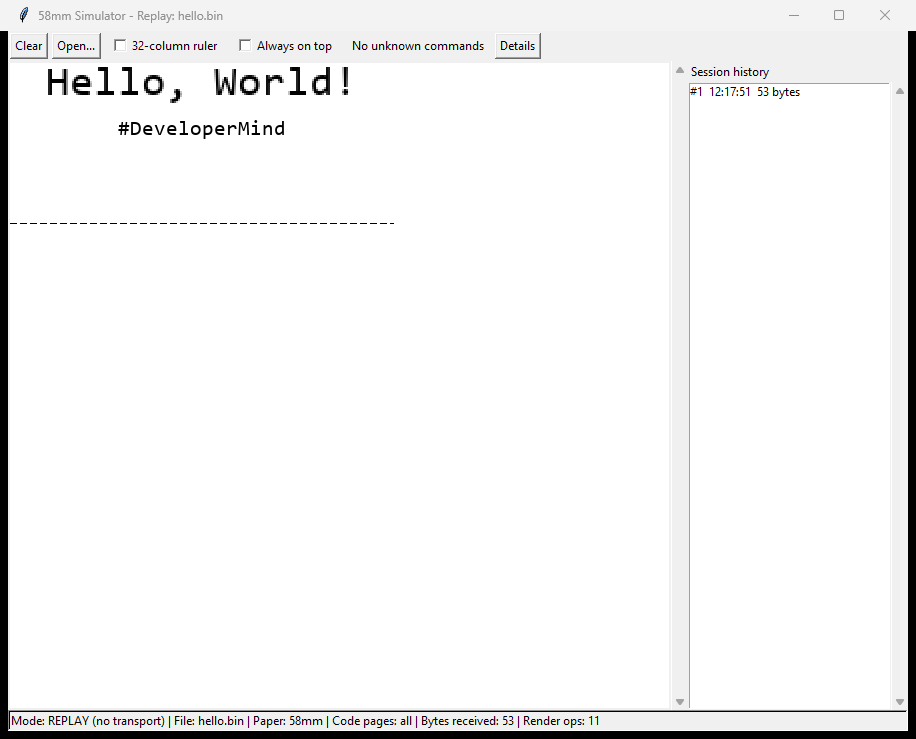
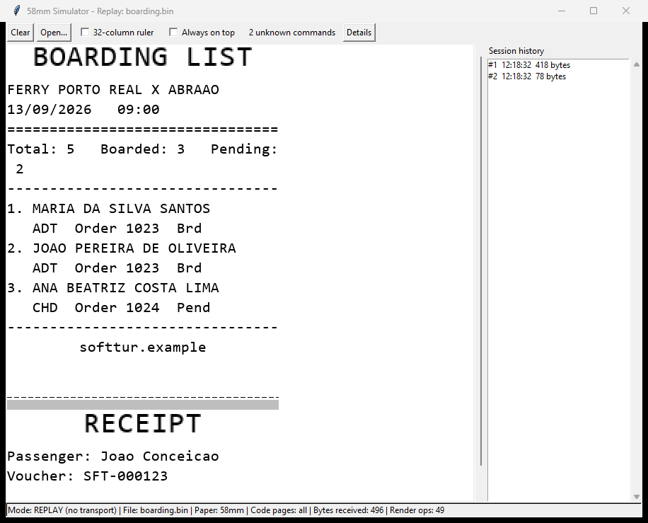

# 58mm/80mm ESC/POS Thermal Printer Simulator

Renders on screen exactly what a real 58mm (or 80mm) Bluetooth thermal
printer would put on paper, by parsing the same raw ESC/POS byte stream
a mobile app would send it. An ESC/POS parser and a Tkinter-based
renderer sit behind a transport abstraction, so the same rendering
pipeline runs unchanged whether the bytes arrive over plain TCP or a
real Bluetooth Classic (SPP) connection.



*Replaying a minimal 53-byte capture: "Hello, World!" printed in
double size, centered, followed by "#DeveloperMind" on the next line.*

## Running it

```
pip install -r requirements.txt
python main.py --transport tcp --port 9100 --width 58
```

This opens a Tkinter window and starts listening for raw ESC/POS bytes
on `127.0.0.1:9100`. In another shell, send a sample ticket:

```
python tools/send_sample.py --port 9100
```

The window updates live as bytes arrive. `--width` accepts `58` (384
dots) or `80` (576 dots) at 203 dpi.

Press **s** while the window has focus to save the current receipt to a
PNG file via a save dialog.

## Transports

Three adapters behind the same `transport/port.py` interface, chosen
with `--transport`:

```
python main.py --transport tcp --port 9100 --width 58
python main.py --transport serial --com COM5 --width 58
python main.py --transport rfcomm --width 58
```

- **`tcp`** (`transport/tcp.py`): plain TCP socket, useful for local
  development and for `tools/send_sample.py` without any Bluetooth
  hardware involved.
- **`serial`** (`transport/serialport.py`, needs `pyserial`): reads
  bytes from a Windows-managed "Bluetooth Serial Port (incoming)" COM
  port. Windows publishes the SDP record for that COM port itself, so
  this path needs no manual SDP registration — only pairing the phone
  and configuring the incoming COM port in Bluetooth settings.
  `pyserial` is imported lazily, so it's only required if you actually
  start this transport.
- **`rfcomm`** (`transport/rfcomm.py`, stdlib only): opens a raw
  `AF_BLUETOOTH`/`BTPROTO_RFCOMM` server socket and publishes an SDP
  record for it via `ctypes` calls into `ws2_32.dll`'s
  `WSASetServiceW`, advertising the well-known Serial Port Profile
  (SPP) UUID `00001101-0000-1000-8000-00805F9B34FB` — the same UUID
  Android's `createRfcommSocketToServiceRecord` looks up. A plain
  Python `AF_BLUETOOTH` socket is otherwise invisible to SDP discovery.
  The RFCOMM channel is not something you choose: this adapter tries
  `bind()` to channel 0 (`BT_PORT_ANY`) first and, if the OS reports
  channel 0 back from `getsockname()` instead of assigning a real one
  (confirmed to be the case on the development machine — see the
  module docstring), falls back to scanning explicit channels 4-30
  until one binds and listens successfully. `--sdp-mode
  {auto,simple,blob}` selects how the SDP record itself is built (see
  CLI reference below).

### Verified status

- **`--transport serial` is the verified, recommended path.** A real
  Flutter app (`print_bluetooth_thermal` + `esc_pos_utils_plus`)
  printed a real receipt over Bluetooth through it end to end.
- **`--transport rfcomm` is experimental, not production-ready.** The
  SDP record registers successfully — confirmed live against
  `ws2_32.dll`, and `python main.py --doctor` reports `[PASS]` for
  both the RFCOMM socket bind and the SDP registration — but no real
  device has ever completed a connection through it. A paired Android
  phone, using both the target app and a generic SPP terminal client,
  failed to connect, and the accept loop (`RfcommPort._accept_loop`)
  was never reached. The root cause is unconfirmed; the two leading
  hypotheses are:
  1. the shape of the SDP record published by the simple
     `WSASetServiceW` form (`--sdp-mode blob` exists to test a
     hand-built record instead — see `transport/sdp_encoding.py`), and
  2. a possible restriction on accepting inbound Bluetooth connections
     under a Microsoft Store (AppContainer) Python build (`--doctor`
     includes a check for this: "Python interpreter restriction
     (Store/AppContainer)").

## CLI reference

```
python main.py --help
```

- `--transport {tcp,rfcomm,serial}` (default `tcp`): transport adapter
  to use.
- `--port PORT` (default `9100`): TCP port to listen on (`--transport
  tcp`).
- `--com COM5`: COM port name, required for `--transport serial`.
- `--width {58,80}` (default `58`): paper width in millimeters.
- `--log-level {DEBUG,INFO,WARNING,ERROR}` (default `INFO`).
- `--codepages LIST|all` (default `all`): comma-separated ESC/POS code
  page ids this printer profile implements (e.g. `0,2,16`), or `all`
  for every id this simulator knows how to decode. Restricting this
  lets you reproduce a specific real printer's code page support.
- `--sdp-mode {auto,simple,blob}` (default `auto`, only relevant for
  `--transport rfcomm`): `auto` tries a hand-built SDP record via
  `lpBlob` first and falls back to `simple` if that fails; `simple`
  always uses the plain `WSASetServiceW` record Windows synthesizes;
  `blob` always uses the hand-built record and never falls back.
- `--dump-bytes PATH`: appends every raw byte received to `PATH` as it
  arrives, turning a real print into a permanent regression fixture
  for `--replay`.
- `--replay PATH`: renders a previously captured byte file (see
  `--dump-bytes`) through a fresh parser and shows it. No transport is
  started, which decouples renderer iteration from real hardware.
- `--doctor`: runs read-only Bluetooth RFCOMM diagnostics and exits
  (does not start the viewer) — see below.
- `--inspect-sdp`: enumerates and decodes what is actually published
  in the local Bluetooth SDP database, and exits (does not start the
  viewer).

## Diagnostics: `--doctor`

```
python main.py --doctor
```

Runs read-only checks and prints one `[PASS]` / `[FAIL]` / `[UNKNOWN]`
line per check, with a concrete remedy on failure: the `bthserv` and
`BTAGService` Windows services, binding a real RFCOMM channel,
registering an SDP record on it, a Python interpreter restriction
check (Microsoft Store/AppContainer builds), PC discoverability
(always `[UNKNOWN]` with the manual Windows 11 path, since there is no
reliable programmatic check for this), and listing paired Bluetooth
devices and Bluetooth-related COM ports via PowerShell. It never
prints `[PASS]` for a check it did not actually run.

## Viewer

Beyond the live receipt canvas, the window includes:

- Vertical scrolling with mouse-wheel support and automatic
  auto-scroll to the bottom on new content when the view was already
  at the bottom (it does not yank you back down if you scrolled up to
  read something older).
- A **Clear** button ("new paper"): empties the receipt area, the
  session history, and the byte/op counters, without disconnecting the
  transport.
- An **Open...** button: loads a previously captured byte file (see
  `--dump-bytes`) through a fresh parser and replaces the current
  content with it, while a live transport (if any) keeps running.
- Receipts are split into separate visual blocks at each `GS V`
  (paper cut) command, drawn with a visible gap between them, so
  several prints in one session read as several receipts instead of
  one continuous strip.
- A **session history** panel listing every receipt seen this
  session (sequence number, timestamp, byte count); clicking an entry
  scrolls the canvas to it.
- A structured **diagnostics** panel: a toolbar counter ("N unknown
  commands") plus a details window listing each unrecognized or
  malformed command with its byte offset and raw hex bytes.
- A **32-column ruler** toggle: draws a vertical guide line at the
  active font's column limit for the current paper width.
- An **always-on-top** window option.



*A two-receipt session: a boarding list and a receipt separated by a
paper cut. The session history panel lists both captures (418 bytes,
78 bytes), the toolbar shows 2 unknown commands, and a line wraps at
the 32-column limit.*

### Line wrapping

Text exceeding the column limit for the active font and paper width
wraps with a **hard character break**, not a word-aware break: the
line is cut at the exact column boundary, mid-word if that is where
the limit falls, matching how a real thermal print head counts
character cells rather than words. The continuation line inherits the
alignment (`left`/`center`/`right`) of the line it was wrapped from.
This behavior was calibrated against physical paper printed by a real
58mm printer, since it is not something a spec alone determines.

### Code page fidelity

Text is decoded using whatever code page was last selected by `ESC t
n`. If the byte stream selects a code page this simulator does not
implement (see `--codepages`), decoding falls back to CP437 — the
factory default on most ESC/POS printers — rather than guessing at the
intended page. An encoding mismatch (e.g. the app selecting one code
page while the actual text was written for another) is rendered as the
resulting mojibake instead of being auto-corrected: hiding the
mismatch would hide the exact bug a user is trying to debug with this
tool.

## Manual verification required

SDP visibility to a real Android device and actual Bluetooth pairing
cannot be exercised by any unit test — they need a second, physically
paired device. The `serial` transport has already been verified this
way (see "Verified status" above); the `rfcomm` transport has not yet
completed a successful connection with a real device. If you want to
retry `rfcomm` against a device of your own:

1. Pair the phone with this PC (Windows Settings > Bluetooth & devices
   > Add device), or run `python main.py --doctor` and follow its PC
   discoverability instructions first if the PC does not show up.
2. Run `python main.py --transport rfcomm --width 58`. Note the
   `RFCOMM (channel N)` window title and the logged channel number
   once the transport has started.
3. From a client app, connect to this PC's Bluetooth device using the
   SPP UUID above and send a print job.
4. Confirm the bytes appear rendered live in the viewer window exactly
   as they would on a real 58mm printer.

If discovery fails, run `python main.py --doctor` again: a `[FAIL]` on
SDP registration will show the real Win32 error code from
`WSASetServiceW`. `python main.py --inspect-sdp` can also show what is
actually published in the local Bluetooth SDP database.

## Architecture

```
[ transport ] --bytes--> [ core (parser) ] --render ops--> [ render ]
```

- `transport/` moves raw bytes and knows nothing about ESC/POS:
  `transport/tcp.py`, `transport/rfcomm.py` and
  `transport/serialport.py` (Bluetooth Classic SPP), all behind the
  same `transport/port.py` interface.
- `core/` (`core/parser.py`, `core/state.py`, `core/commands.py`,
  `core/ops.py`) turns the byte stream into a list of render
  operations. It has **no import of `transport/` or `render/`** — see
  the boundary check below.
- `render/` (`render/raster.py`, `render/viewer.py`) turns render
  operations into a PIL image and displays it live in a Tkinter window.

This mirrors real 58mm printer hardware: in a cheap thermal printer the
Bluetooth module is just an SPP-to-UART bridge, and the print MCU that
interprets ESC/POS commands has no notion that Bluetooth (or, here,
TCP) exists. Keeping that boundary in code means adding a new
transport only requires a new `transport/` module implementing `Port`
— the parser and renderer do not change.

To re-verify the boundary yourself:

```
grep -rnE "^\s*(import|from)\s+(transport|render)\b" core/
grep -rnE "^\s*(import|from)\s+transport\b" render/
```

Both should print nothing.

## Composition root

`main.py` is the only module allowed to import from `transport/`,
`core/` and `render/` at once. It picks the transport adapter from
`--transport`, feeds every received chunk to `core.parser.Parser`, and
hands the resulting ops to the viewer — hopping back onto the Tk main
thread via `Viewer.call_soon()` since the transport delivers bytes on a
background thread.

## Supported ESC/POS commands

LF, ESC @, ESC a, ESC E, ESC -, ESC M, ESC !, ESC t, ESC R, ESC d,
ESC e, ESC 2 / ESC 3, ESC {, ESC V, ESC p (cash drawer event), ESC *
(column bit image), GS !, GS B, GS V (paper cut), GS v 0 (raster bit
image), GS k (barcode, both NUL-terminated and length-prefixed forms),
GS h / GS w / GS f / GS H (barcode configuration), GS ( k (QR code:
model/size/error-correction/store/print), and DLE EOT (status query —
parsed and discarded, never answered).

Barcodes and QR codes are rendered as a labeled placeholder box showing
the symbology/config and the encoded data rather than a scannable
symbol — getting the byte-level parsing right matters more for a
debugging tool than a perfect glyph, and this adds no new dependencies.

Any unrecognized or malformed command is logged (with its offset in the
stream and the raw hex bytes) and skipped without raising. The parser
buffers incomplete commands across `feed()` calls, so a command split
across two socket reads still parses correctly once the rest arrives.

## Out of scope

- Any read/response path. `print_bluetooth_thermal` (the Flutter
  package used by the real app) has no read method — a real printer
  connection is write-only from the app's side. `DLE EOT` status
  queries are parsed only to stay in sync with the byte stream, then
  discarded; nothing is ever written back to a real printer.
- Scannable barcode/QR rendering (see above).
- Non-uniform bold weight rendering: `ESC E` / bold state is tracked
  correctly, but PIL cannot synthesize a bold weight from a single
  regular-weight TTF, so bold text renders at the regular weight unless
  a bold font file is added later.

## Tests

```
python -m pytest
```

Strict TDD was used throughout: every command, style transition,
streaming/split-command case, and the unknown-byte robustness
requirement has a test that was written and observed to fail before
the corresponding implementation was added. The one exception is the
four interdependent ctypes Win32 structs (`GUID`, `SOCKADDR_BTH`,
`CSADDR_INFO`, `WSAQUERYSETW`) in `transport/rfcomm.py`, which were
implemented together after their tests, since they only compile/link
meaningfully as a group.

## License

Licensed under the Apache License, Version 2.0. See [LICENSE](LICENSE) and
[NOTICE](NOTICE).

You may use, modify and redistribute this software, including commercially,
provided you keep the copyright notice and the license text with any copy or
derivative work, state any significant changes you made, and do not use the
author's name to endorse your derivative. The license also grants an explicit
patent licence from the contributors.
